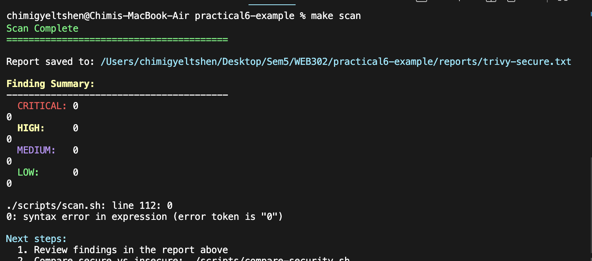

# Infrastructure as Code with Terraform

## [Repository Link](https://github.com/C-gyeltshen/iac-terraform-demo.git)

## Table of Contents

- [Overview](#overview)
- [What is Infrastructure as Code?](#what-is-infrastructure-as-code)
- [What is Terraform?](#what-is-terraform)
- [Importance of IaC with Terraform](#importance-of-iac-with-terraform)
- [Project Architecture](#project-architecture)
- [Prerequisites](#prerequisites)
- [Implementation Steps](#implementation-steps)
- [Project Structure](#project-structure)
- [Security Considerations](#security-considerations)
- [Screenshots](#screenshots)
- [Troubleshooting](#troubleshooting)
- [Conclusion](#conclusion)

---

## Overview

This project demonstrates the implementation of **Infrastructure as Code (IaC)** using **Terraform** to provision and manage AWS infrastructure for a Next.js web application. The infrastructure is tested locally using **LocalStack**, which emulates AWS services in a containerized environment.

---

## What is Infrastructure as Code?

**Infrastructure as Code (IaC)** is the practice of managing and provisioning computing infrastructure through machine-readable definition files, rather than through physical hardware configuration or interactive configuration tools.

### Key Characteristics:

- **Declarative Approach**: Define what you want, not how to achieve it
- **Version Control**: Infrastructure configurations stored in Git
- **Automation**: Eliminates manual configuration and human error
- **Consistency**: Same infrastructure deployed across environments
- **Documentation**: Code serves as living documentation

---

## What is Terraform?

**Terraform** is an open-source IaC tool created by HashiCorp that allows you to define both cloud and on-premises resources in human-readable configuration files that you can version, reuse, and share.

### Key Features:

- **Multi-Cloud Support**: Works with AWS, Azure, GCP, and 100+ providers
- **Declarative Configuration**: Uses HashiCorp Configuration Language (HCL)
- **State Management**: Tracks infrastructure state for change detection
- **Plan Before Apply**: Preview changes before execution
- **Modularity**: Reusable modules for common patterns

---

## Importance of IaC with Terraform

### 1. **Reproducibility**

- Deploy identical infrastructure across development, staging, and production
- Eliminate "works on my machine" problems
- Disaster recovery becomes straightforward

### 2. **Version Control and Collaboration**

- Track all infrastructure changes in Git
- Review infrastructure changes through pull requests
- Rollback to previous infrastructure versions if needed

### 3. **Cost Optimization**

- Destroy test environments when not needed
- Provision resources on-demand
- Track resource usage through code

### 4. **Speed and Efficiency**

- Provision entire infrastructure in minutes
- Automate repetitive tasks
- Reduce time from development to production

### 5. **Reduced Human Error**

- Eliminate manual configuration mistakes
- Enforce best practices through code review
- Standardized configurations across teams

### 6. **Documentation**

- Infrastructure configuration serves as documentation
- Always up-to-date (code is the truth)
- Easy to understand infrastructure dependencies

### 7. **Security and Compliance**

- Enforce security policies as code
- Audit trail of all infrastructure changes
- Automated compliance checks

---

## Project Architecture

This project provisions the following AWS resources using Terraform:

```
┌─────────────────────────────────────────────┐
│           LocalStack (AWS Emulator)         │
│                                             │
│  ┌──────────────────────────────────────┐  │
│  │   S3 Deployment Bucket               │  │
│  │   - Static Website Hosting           │  │
│  │   - Versioning Enabled               │  │
│  │   - KMS Encryption                   │  │
│  │   - Public Read Access               │  │
│  └──────────────────────────────────────┘  │
│                                             │
│  ┌──────────────────────────────────────┐  │
│  │   S3 Logs Bucket                     │  │
│  │   - Access Logs Storage              │  │
│  │   - KMS Encryption                   │  │
│  │   - Private Access Only              │  │
│  └──────────────────────────────────────┘  │
│                                             │
│  ┌──────────────────────────────────────┐  │
│  │   KMS Keys                           │  │
│  │   - Encryption for S3 buckets        │  │
│  └──────────────────────────────────────┘  │
│                                             │
│  ┌──────────────────────────────────────┐  │
│  │   IAM Policies                       │  │
│  │   - Deployment permissions           │  │
│  └──────────────────────────────────────┘  │
└─────────────────────────────────────────────┘
```

---

## Prerequisites

Before implementing this project, ensure you have the following installed:

### Required Software:

- **Docker Desktop** (v20.10 or higher)
- **Terraform** (v1.0 or higher)
- **tflocal** (Terraform wrapper for LocalStack)
- **AWS CLI** (v2.x)
- **awslocal** (AWS CLI wrapper for LocalStack)
- **Node.js** (v18 or higher)
- **Make** (for running Makefile commands)

### Installation Commands:

```bash
# Install Terraform
brew install terraform

# Install tflocal
pip install terraform-local

# Install awslocal
pip install awscli-local

# Install AWS CLI
brew install awscli

# Verify installations
terraform --version
tflocal --version
awslocal --version
docker --version
```

---

## Implementation Steps

### Step 1: Environment Setup

First, clone the project and navigate to the project directory:

```bash
cd /path/to/practical6-example
```

### Step 2: Start LocalStack

LocalStack provides a local AWS cloud stack for testing and development.

```bash
# Using Make
make setup

# Or using Docker Compose directly
docker-compose up -d

# Verify LocalStack is running
curl http://localhost:4566/_localstack/health
```

**Expected Output:**

```json
{
  "services": {
    "s3": "running",
    "iam": "running",
    "logs": "running",
    "sts": "running"
  }
}
```

### Step 3: Initialize Terraform

Navigate to the Terraform directory and initialize:

```bash
cd terraform

# Initialize Terraform (downloads providers and modules)
tflocal init
```

**What happens during initialization:**

- Downloads the AWS provider plugin (~5.0)
- Creates `.terraform` directory
- Creates `.terraform.lock.hcl` lock file
- Prepares backend for state management

### Step 4: Review Terraform Configuration

Examine the main Terraform files:

#### **main.tf** - Provider Configuration

```hcl
terraform {
  required_version = ">= 1.0"
  required_providers {
    aws = {
      source  = "hashicorp/aws"
      version = "~> 5.0"
    }
  }
}

provider "aws" {
  access_key = "test"
  secret_key = "test"
  region     = "us-east-1"

  # LocalStack configuration
  skip_credentials_validation = true
  skip_metadata_api_check     = true
  skip_requesting_account_id  = true
  s3_use_path_style           = true

  endpoints {
    s3   = "http://localhost:4566"
    iam  = "http://localhost:4566"
    # ... other services
  }
}
```

#### **variables.tf** - Input Variables

```hcl
variable "project_name" {
  description = "Project name used for resource naming"
  type        = string
  default     = "practical6"
}

variable "environment" {
  description = "Environment name"
  type        = string
  default     = "dev"
}
```

#### **s3.tf** - S3 Bucket Resources

Defines:

- Deployment bucket with static website hosting
- Logs bucket for access logs
- KMS encryption keys
- Bucket versioning and policies

#### **iam.tf** - IAM Resources

Contains IAM roles and policies for deployment (example code for production use)

### Step 5: Plan Infrastructure Changes

Before applying changes, review what Terraform will create:

```bash
# Generate and review execution plan
tflocal plan

# Save plan to file for review
tflocal plan -out=tfplan
```

**Key Information in Plan:**

- Resources to be created (prefixed with `+`)
- Resources to be modified (prefixed with `~`)
- Resources to be destroyed (prefixed with `-`)
- Total count of changes

### Step 6: Apply Infrastructure

Deploy the infrastructure:

```bash
# Apply the saved plan
tflocal apply tfplan

# Or apply with auto-approval (use with caution)
tflocal apply -auto-approve
```

**Expected Output:**

```
Apply complete! Resources: 12 added, 0 changed, 0 destroyed.

Outputs:

deployment_bucket_name = "practical6-deployment-dev"
deployment_bucket_url = "http://practical6-deployment-dev.s3-website-us-east-1.localhost.localstack.cloud:4566"
logs_bucket_name = "practical6-logs-dev"
```

### Step 7: Verify Infrastructure

Verify that resources were created successfully:

```bash
# List S3 buckets
awslocal s3 ls

# Check bucket details
awslocal s3 ls s3://practical6-deployment-dev

# View Terraform state
tflocal show

# Check specific outputs
tflocal output deployment_bucket_name
```

### Step 8: Deploy Application

Build and deploy the Next.js application:

```bash
# Return to project root
cd ..

# Run deployment script
./scripts/deploy.sh

# Or using Make
make deploy
```

**The deployment script performs:**

1. Checks LocalStack status
2. Applies Terraform configuration
3. Builds Next.js application
4. Uploads build artifacts to S3
5. Verifies deployment

### Step 9: Access the Application

Open your browser and navigate to:

```
http://practical6-deployment-dev.s3-website-us-east-1.localhost.localstack.cloud:4566
```

### Step 10: Monitor and Manage

```bash
# Check deployment status
./scripts/status.sh

# View infrastructure state
tflocal state list

# Show specific resource
tflocal state show aws_s3_bucket.deployment
```

### Step 11: Security Scanning (Optional)

Run Trivy security scans:

```bash
# Scan Terraform code for security issues
./scripts/scan.sh

# Compare secure vs insecure configurations
./scripts/compare-security.sh
```

### Step 12: Cleanup

When finished, destroy the infrastructure:

```bash
# Using Terraform
cd terraform
tflocal destroy

# Or using cleanup script
./scripts/cleanup.sh

# Stop LocalStack
docker-compose down
```

---

## Project Structure

```
practical6-example/
├── README.md                    # This file
├── docker-compose.yml           # LocalStack container configuration
├── Makefile                     # Build automation
├── trivy.yaml                   # Security scanning configuration
│
├── terraform/                   # Infrastructure as Code
│   ├── main.tf                 # Provider and backend configuration
│   ├── variables.tf            # Input variables
│   ├── outputs.tf              # Output values
│   ├── s3.tf                   # S3 bucket resources
│   ├── iam.tf                  # IAM policies and roles
│   └── terraform.tfstate       # State file (git-ignored)
│
├── terraform-insecure/          # Insecure configuration examples
│   ├── s3-insecure.tf          # Poor security practices (for comparison)
│   └── iam-insecure.tf         # Insecure IAM setup
│
├── nextjs-app/                  # Next.js application
│   ├── package.json            # Node.js dependencies
│   ├── next.config.js          # Next.js configuration
│   └── app/                    # Application source code
│
├── scripts/                     # Automation scripts
│   ├── setup.sh                # Initial environment setup
│   ├── deploy.sh               # Deployment automation
│   ├── status.sh               # Check deployment status
│   ├── scan.sh                 # Security scanning
│   ├── rollback.sh             # Rollback deployment
│   ├── cleanup.sh              # Resource cleanup
│   └── verify-deployment.sh    # Deployment verification
│
├── init-scripts/                # LocalStack initialization
│   └── 01-setup.sh             # LocalStack startup script
│
├── images/                      # Documentation screenshots
│   └── 1.png                   # Architecture diagram
│
└── reports/                     # Security scan reports
    ├── trivy-secure.txt        # Secure configuration scan
    └── trivy-insecure.txt      # Insecure configuration scan
```

---

## Security Considerations

### Implemented Security Features:

1. **S3 Bucket Encryption**

   - KMS encryption for data at rest
   - Separate KMS keys for different buckets
   - Server-side encryption enabled by default

2. **S3 Bucket Versioning**

   - Enables recovery from accidental deletions
   - Maintains history of object changes
   - Supports compliance requirements

3. **Access Logging**

   - Dedicated logs bucket for audit trails
   - Tracks all access requests
   - Helps detect unauthorized access

4. **Public Access Block**

   - Prevents accidental public exposure
   - Controlled through explicit bucket policies
   - Defense in depth approach

5. **Least Privilege IAM**
   - Minimal permissions for deployment users
   - Specific resource-based policies
   - No wildcard (\*) permissions

### Security Best Practices:

```hcl
# ✅ GOOD: Encrypted bucket with versioning
resource "aws_s3_bucket_server_side_encryption_configuration" "deployment" {
  bucket = aws_s3_bucket.deployment.id
  rule {
    apply_server_side_encryption_by_default {
      sse_algorithm     = "aws:kms"
      kms_master_key_id = aws_kms_key.s3_deployment.arn
    }
  }
}

# ❌ BAD: No encryption, public ACLs
resource "aws_s3_bucket" "insecure" {
  bucket = "my-bucket"
  acl    = "public-read"  # Avoid this!
}
```

---

## Screenshots

### Infrastructure Overview


_Figure 1: Infrastructure architecture showing AWS resources provisioned by Terraform_

### Terraform Commands Output

_Add screenshots of:_

- `tflocal plan` output
- `tflocal apply` success message
- `awslocal s3 ls` bucket listing
- Application running in browser

---

## Troubleshooting

### Common Issues and Solutions:

#### 1. LocalStack Not Running

```bash
# Error: Connection refused on localhost:4566
# Solution:
docker-compose up -d
curl http://localhost:4566/_localstack/health
```

#### 2. Terraform State Lock

```bash
# Error: state locked
# Solution:
tflocal force-unlock <lock-id>
```

#### 3. S3 Bucket Already Exists

```bash
# Error: BucketAlreadyExists
# Solution:
tflocal destroy
awslocal s3 rb s3://bucket-name --force
tflocal apply
```

#### 4. Permission Denied on Scripts

```bash
# Error: permission denied
# Solution:
chmod +x scripts/*.sh
```

#### 5. Docker Daemon Not Running

```bash
# Error: Cannot connect to Docker daemon
# Solution:
# Start Docker Desktop application
open -a Docker
```

---

## Conclusion

This project demonstrates the power and importance of **Infrastructure as Code** using **Terraform**. Key takeaways:

### Benefits Achieved:

✅ **Automation**: Infrastructure provisioned in minutes, not hours  
✅ **Consistency**: Same infrastructure across all environments  
✅ **Version Control**: All changes tracked in Git  
✅ **Security**: Best practices enforced through code  
✅ **Documentation**: Code serves as living documentation  
✅ **Cost Efficiency**: Easy to create and destroy environments  
✅ **Disaster Recovery**: Quick infrastructure reconstruction

### Skills Developed:

- Writing Terraform configurations in HCL
- Managing infrastructure state
- Implementing AWS security best practices
- Automating deployment workflows
- Testing infrastructure locally with LocalStack
- Security scanning with Trivy

### Next Steps:

1. **Multi-Environment Setup**: Create dev, staging, and production workspaces
2. **Remote State**: Use S3 backend for team collaboration
3. **Terraform Modules**: Create reusable infrastructure components
4. **CI/CD Integration**: Automate with GitHub Actions or GitLab CI
5. **Production Deployment**: Apply to real AWS account
6. **Monitoring**: Add CloudWatch and alerting
7. **Advanced Security**: Implement AWS WAF and GuardDuty

---

## Resources

### Official Documentation:

- [Terraform Documentation](https://www.terraform.io/docs)
- [AWS Provider Documentation](https://registry.terraform.io/providers/hashicorp/aws/latest/docs)
- [LocalStack Documentation](https://docs.localstack.cloud)
- [Terraform Best Practices](https://www.terraform-best-practices.com)

### Useful Commands Reference:

```bash
# Terraform Commands
tflocal init              # Initialize Terraform
tflocal validate          # Validate configuration
tflocal plan              # Preview changes
tflocal apply             # Apply changes
tflocal destroy           # Destroy infrastructure
tflocal state list        # List resources in state
tflocal output            # Show output values
tflocal fmt               # Format configuration files

# AWS LocalStack Commands
awslocal s3 ls            # List S3 buckets
awslocal s3 cp            # Copy files to S3
awslocal iam list-users   # List IAM users
awslocal logs describe-log-groups  # List CloudWatch logs

# Docker Commands
docker-compose up -d      # Start services
docker-compose down       # Stop services
docker-compose logs -f    # View logs
docker ps                 # List running containers

# Make Commands
make setup                # Setup environment
make deploy               # Deploy application
make status               # Check status
make scan                 # Run security scan
make clean                # Cleanup resources
```

---

## Author & Acknowledgments

This project was created for **WEB302 - Practical 6** to demonstrate Infrastructure as Code principles using Terraform and AWS services.

**Technologies Used:**

- Terraform v1.0+
- LocalStack
- AWS S3, IAM, KMS
- Next.js
- Docker
- Trivy Security Scanner

---

## License

This project is created for educational purposes as part of WEB302 coursework.

---

**Last Updated:** October 22, 2025
